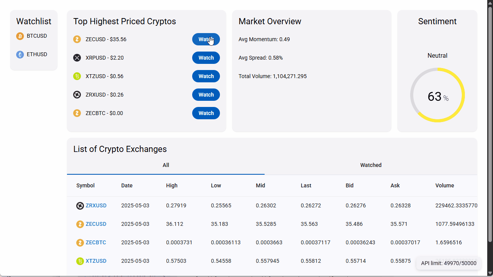

# NDLView

This project is a web UI accessing [Nasdaq Data Link API](https://www.nasdaq.com/solutions/data/nasdaq-data-link/api), crypto currency table endpoint. Frontend uses [Angular](https://github.com/angular/angular-cli). UI framework [Angular Material](https://material.angular.io/). Postgres for data storage, currently a serverless one.

## Features

A list of what this app does.

- Displays a list of cryptos with data from previous day.
- Displays a ranked "top 5" list based on previous day's prices.
- Displays simple market summary statistics from previous day.
- Displays a crypto's rate history within a time window.
- Let user add cryptos from the top list to a personal watchlist.
- Let user remove cryptos from the watchlist through the top list.
- Let user filter the crypto list based on the watchlist.
- Let user load remaining pages of data (lazy loading).

## Screenshot


# Docs

## Development settings

Using a super simple Express backend to hide API key from browser, and provide mock data for frontend iterations.

Before first run, run `npm run inst` under project root. Then each time afterwards:

- `npm run fr` for frontend.

- `npm run bk` for backend. This uses Nodemon for hot reloading.

Note: These are scripts defined in root *package.json*.

## Deployment settings

### Vercel

Deployed as 2 apps for seperation of concerns. Both of them have bash command:

```
if [[ "$VERCEL_GIT_COMMIT_MESSAGE" == *"[skip]"* ]]; then exit 0; else exit 1; fi
```

to cancel build when git commit message contains certain words such as "[skip]".

## Tools and scripts

In root *package.json*:

`npm run cp-mdl`: Synchronize shared models.

## Implementation notes

### Type consistency

There are model classes shared between client side and server side for type consistency. See *./shared/models* for details.

### Data validation

#### class CryptoEntry

On client side. Guarding against wrong types and illogical ranges. For example, if high $<$ low, it will throw an error in console with a message like this:
    
    Error: high (10.0) should be > low (11.0).

Handled by a factory method `static parseApiRow()`.

#### class WatchlistEntry

On server side. Guarding against wrong types and illogical ranges. `isValidWatchlistEntry()` in *validators.ts*.

### Synch patterns

#### class WatchlistService

Maintains single source of truth for the watchlist. Inherently complies to the *Observer* pattern.

#### db.ts (backend)

Has a *Singleton*, a general Postgres DB handler instance.

# Acknowledgements

Crypto currency icons are by [cryptocurrency-icons](https://github.com/spothq/cryptocurrency-icons), under [CC0-1.0 license](https://creativecommons.org/publicdomain/zero/1.0/).